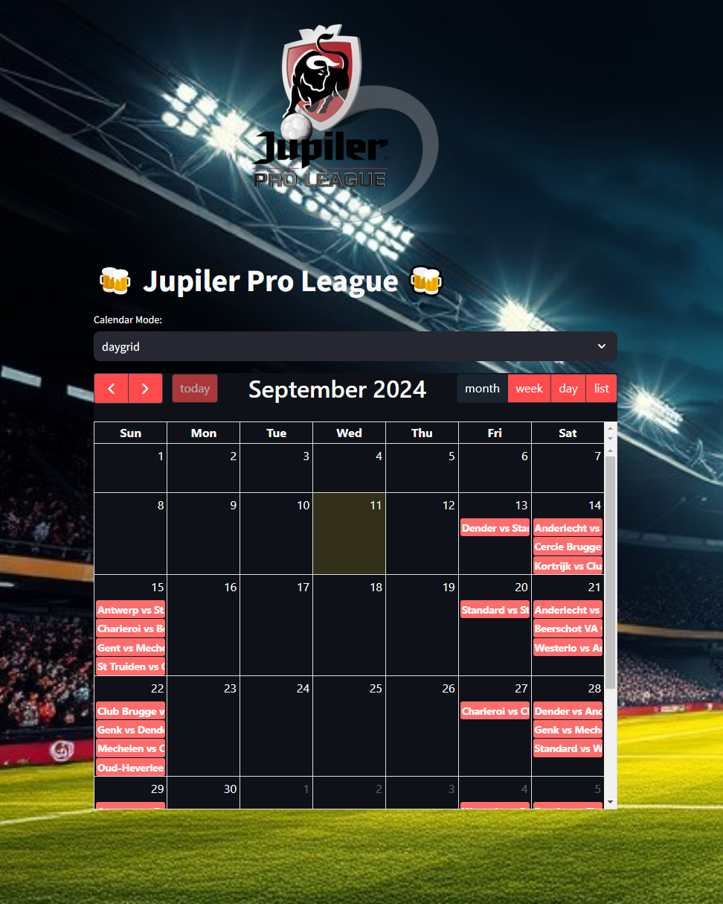
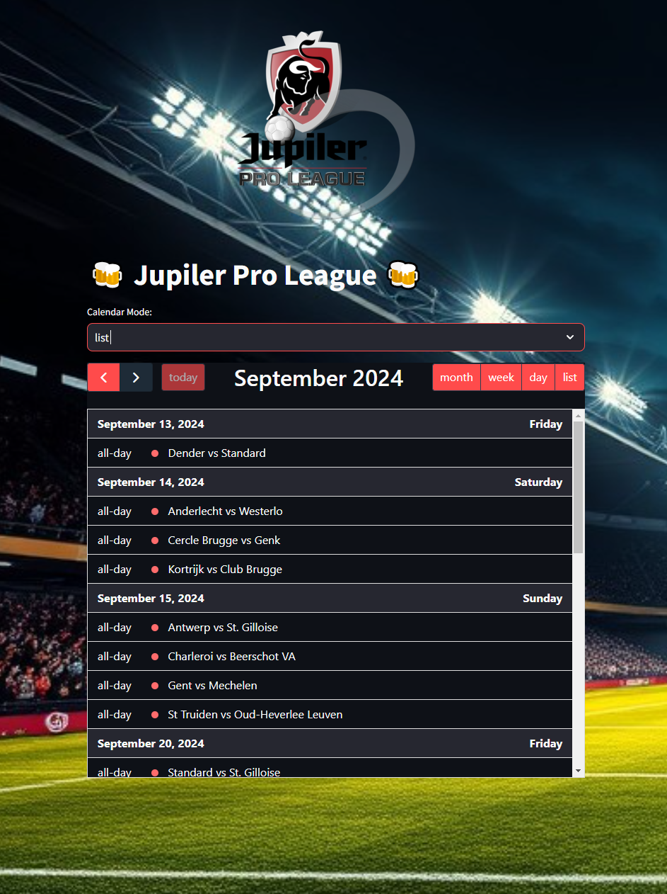
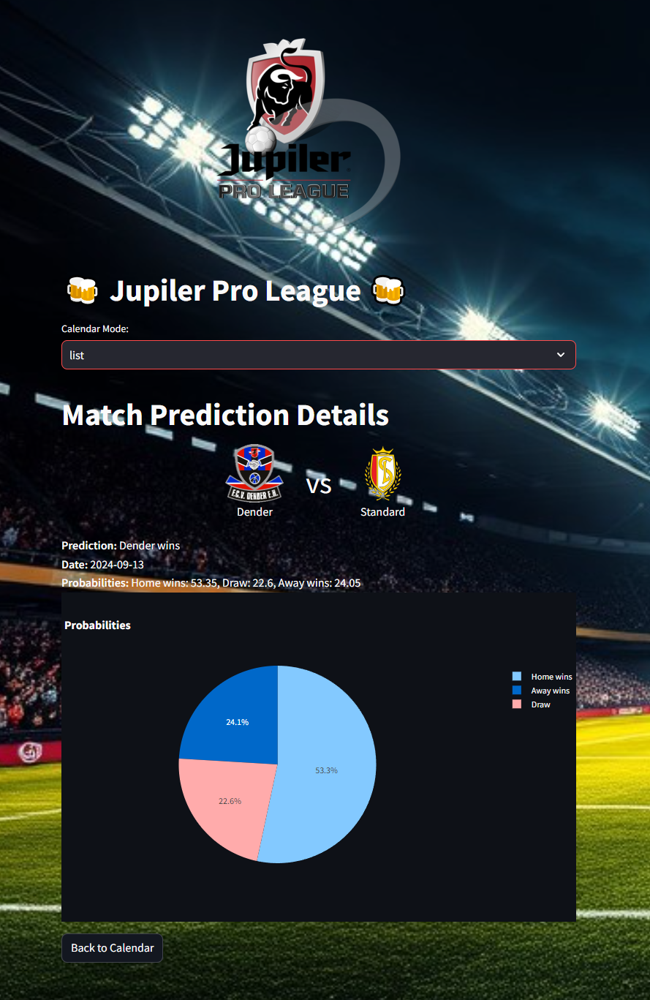

# ⚽ Football Match Prediction App

Welcome to the **Football Match Prediction App**! 🎉 This web application leverages predictive models to forecast football match outcomes. Built with Streamlit, this app provides an interactive calendar to view predictions and detailed statistics for each match.

## 🚀 Features

- **Interactive Calendar**: View upcoming football matches in a visually engaging calendar format. Choose between "daygrid" and "list" views for better usability.
- **Match Predictions**: Get predictions for each match with the option to see which team is most likely to win, or if a draw is predicted.
- **Team Logos**: Matches are displayed with team logos for a better visual experience.
- **Detailed Stats**: Click on any match to view detailed predictions, probabilities, and a pie chart of the forecasted outcomes.

## 📈 Technologies Used

- **Streamlit**: For building the interactive web application.
- **Pandas**: To handle and manipulate data.
- **Plotly**: To visualize predictions with interactive pie charts.
- **HTML & CSS**: For styling and layout.

## 📦 Installation

1. **Clone the Repository**
   ```bash
   git clone https://github.com/yourusername/football-match-prediction-app.git
   cd football-match-prediction-app

2. **Install Dependencies**
    Make sure you have Python 3.x installed. Then, install the required libraries:
    ```bash
    pip install streamlit pandas plotly
3. **Run the Application**
    ```bash
    streamlit run app.py
    ```
    This will start the Streamlit server and open the app in your default web browser.

## 📂 Data
- Predictions Data: The app expects a CSV file named predictions.csv located in the data/ folder. Ensure the CSV file contains columns for HomeTeam, AwayTeam, Date, FTR_H, FTR_D, FTR_A, and Prediction.
- Team Logos: Place team logo images in the data/logos/ folder. Each logo should be named according to the team (e.g., team1.png).
## 🖼️ Screenshots
### Calendar view


### Match Details


## 🤝 Contributing
Contributions are welcome! Please fork the repository and submit a pull request with your improvements.

## 📧 Contact
For any questions or feedback, please reach out to antoine.servais1307@gmail.com

# Enjoy predicting the outcomes of your favorite football matches! ⚽📊

